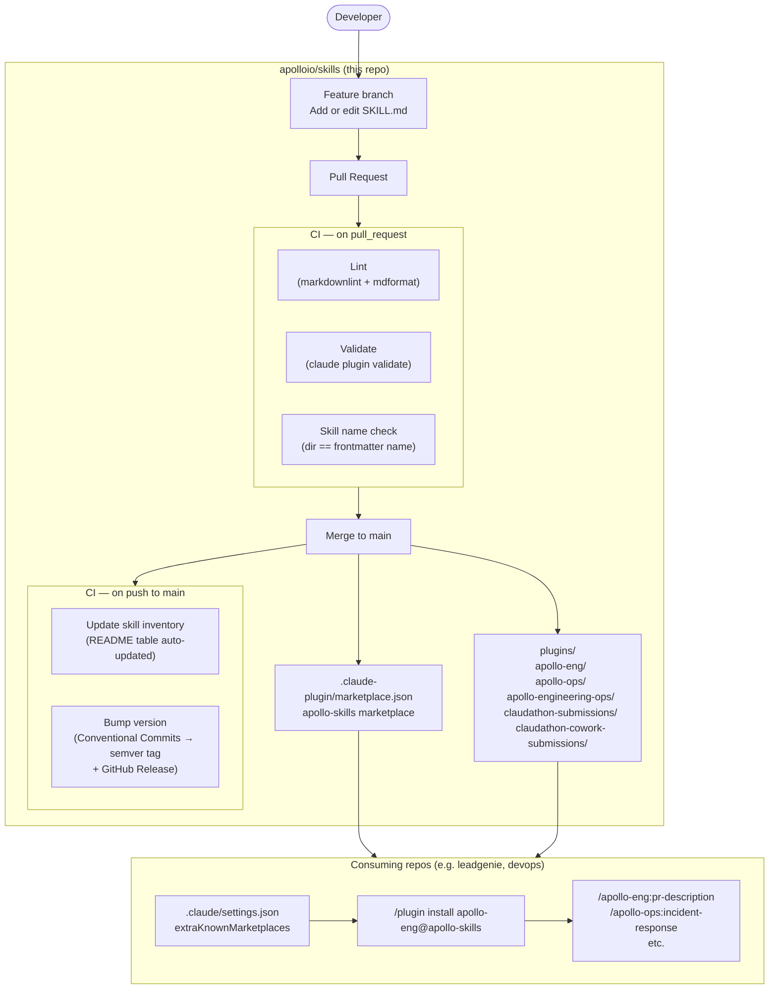

# Skills

This repo is a place to add [skills and plugins](https://code.claude.com/docs/en/plugins) for Claude Code. We may host it as a [private plugin marketplace](https://code.claude.com/docs/en/plugin-marketplaces#private-repositories) so teams can install and use these plugins across multiple repos, including Cowork-oriented plugins for shared internal workflows.

**Note:** This repo is currently an experiment used to explore how we could potentially use plugins for [Claudathon — Build Claude Commands & Skills](https://www.notion.so/apolloio/Claudathon-Build-Claude-Commands-Skills-312ab2b3b4968076b5a7e32f8d8ef76f?source=copy_link).

## How this repo works



## Where Do Skills Go at Apollo?

There are three places you can store Claude skills depending on your use case:

1. **In this central skill repository** — This repo is Apollo’s [private plugin marketplace](https://code.claude.com/docs/en/plugin-marketplaces#private-repositories), making shared skills available across all Apollo repos.

1. **In repo-specific skill folders** — If a skill is only relevant to a specific repository, place it in that repo's `.claude/skills` directory. Examples:

   - [`apolloio/devops/.claude/skills`](https://github.com/apolloio/devops/tree/master/.claude/skills)
   - [`apolloio/leadgenie/.claude/skills`](https://github.com/apolloio/leadgenie/tree/master/.claude/skills)

1. **In `~/.claude/skills`** — For personal skills that are specific to your local development environment and not meant to be shared.

## Skill Inventory

<!-- SKILL-INVENTORY-START -->
| Plugin | Command | Description |
| --- | --- | --- |
| apollo-eng | `/apollo-eng:bug-bash-generator` | Generate bug bash test cases from a Notion bug bash page and write them to a Notion test case database. Activate when user asks to generate bug bash test cases, create bug bash tests, or mentions bug bash generation. |
| apollo-eng | `/apollo-eng:learn-from-chat` | Review the current conversation to identify user corrections, preferences, and patterns, then save them to Claude Code memory. Activate when the user says "learn from this chat", "learn from chat", "what did you learn", or "update your memory from this conversation". |
| apollo-eng | `/apollo-eng:plan-from-jira` | Fetches a Jira ticket using the Jira MCP, analyzes the requirements, and generates a structured implementation plan. Activate when the user provides a Jira issue key and asks to plan or implement it, says "plan from jira", "plan this ticket", or "create a plan for <TICKET-ID>". |
| apollo-eng | `/apollo-eng:pr-description` | Generate a clear PR title and description from the current branch's changes. Use when the user asks to fill the PR template, generate a PR description, prepare a PR, create a pull request, or before running gh pr create. |
| apollo-eng | `/apollo-eng:product-ship-post` | Generate product ship room posts for Slack announcements. Activate when user asks to write a ship post, product ship room post, release notes, or feature launch announcement. |
| apollo-eng | `/apollo-eng:security-review` | Perform security audit of Ruby controllers for IDOR vulnerabilities. Activate when user asks for security review, IDOR check, or authorization audit. |
| apollo-engineering-ops | `/apollo-engineering-ops:learn-about-skills` | Explain how Cowork skills and plugins work in Apollo's shared skills marketplace. Use when the user asks how Cowork skills work, wants to browse or understand shared plugins, or wants help writing a new skill and opening a PR to add it to apolloio/skills. |
| apollo-ops | `/apollo-ops:cursor-rules` | Export Apollo skills as Cursor rules (.mdc files) into a project's .cursor/rules/ directory. Activate when the user wants to use Apollo skills in Cursor, asks to set up Cursor rules, export skills to Cursor, or mentions cursor-rules or .mdc. |
| apollo-ops | `/apollo-ops:devops` | Apollo SRE orchestrator — apply reliability engineering to any production task. Activate when discussing incidents, reliability design reviews, production debugging, architecture proposals, alert tuning, performance regressions, or toil reduction. |
| apollo-ops | `/apollo-ops:grafana-observability` | Grafana dashboard design and alert quality specialist. Activate when reviewing or creating Grafana dashboards, tuning alerts, reducing alert fatigue, designing SLO-based alerting, or conducting observability reviews. |
| apollo-ops | `/apollo-ops:incident-response` | Incident commander guide for Apollo production incidents. Activate when declaring or managing an incident, writing stakeholder communications, conducting a postmortem, or defining incident severity. |
| apollo-ops | `/apollo-ops:kubernetes-specialist` | Kubernetes debugging and rollout specialist for Apollo's GKE clusters. Activate when debugging pod crashes, CrashLoopBackOff, OOMKilled, readiness or liveness failures, deployment rollouts, HPA scaling, or resource limit tuning. |
| apollo-ops | `/apollo-ops:systematic-debugging` | Apply a four-phase root-cause debugging methodology to any production issue. Activate when the user is debugging a production problem, performance regression, or unexpected system behavior. |
<!-- SKILL-INVENTORY-END -->

## Repository Structure

```text
.claude/
    settings.json
.claude-plugin/
    marketplace.json
.github/
    workflows/          # CI: lint, validate, bump-version, skill-pr-review, update-skill-inventory
    scripts/            # Helper scripts used by workflows
    skill-review-rubric.md
template/
    .claude-plugin/
        plugin.json
    skills/
        example/
            SKILL.md
plugins/
    apollo-eng/         # Shared engineering skills
        .claude-plugin/
            plugin.json
        skills/
            pr-description/
                SKILL.md
    apollo-ops/         # DevOps and SRE skills
        ...
```

## How to Use in Claude Code

**When you work in this repo:** `.claude/settings.json` is configured so the **apollo-skills** marketplace is offered and **apollo-eng** is enabled for this project. The first time you open the repo, Claude Code may prompt you to add the marketplace; after you install the plugin once, it stays enabled here.

1. **Add the marketplace** (one-time, in Claude Code):

   ```text
   /plugin marketplace add git@github.com:apolloio/skills
   ```

1. **Install a plugin**

   - From the UI: **Browse and install plugins** → **apollo-skills** → **apollo-eng** → Install now
   - Or run: `/plugin install apollo-eng@apollo-skills`

1. **Use a skill**
   Mention it in chat (e.g. “Use the pr-description skill to generate a PR description”) or run a command: `/apollo-eng:pr-description`

Skills from this marketplace can also be used in Claude.ai and the API when those products support plugin marketplaces.

## Using Skills From Other AI Tools

> [!WARNING]
> **Token budget:** Each skill you load adds tokens to every request. Only load the skills you need for a session — loading many at once can significantly increase costs and reduce response quality.
>
> **These docs are experimental.** Windsurf and Cursor skill support is evolving quickly. If something below is wrong or has changed, please test it and update this section.

### Windsurf

Windsurf's [Cascade](https://docs.windsurf.com/windsurf/getting-started) supports Claude models. Individual BYOK users can add keys for Claude 4 Sonnet, Sonnet Thinking, Opus, or Opus Thinking from the model dropdown.

**Setup:**

1. Open Cascade in Windsurf.

1. Choose a Claude model from the model dropdown.

1. Place your skill file in one of these locations:

   | Scope | Path |
   | --- | --- |
   | Workspace-local | `.windsurf/skills/<skill-name>/` |
   | Claude-compatible (if Claude Code config reading is enabled) | `.claude/skills/<skill-name>/` or `~/.claude/skills/<skill-name>/` |

Copy the `SKILL.md` file from this repo into the appropriate folder. Cascade will pick it up as context when you reference it.

### Cursor

Cursor loads skills from `.claude/skills/` for compatibility with Claude Code. Place any `SKILL.md` file there and Cursor will pick it up automatically — no extra configuration needed.

See the [Cursor skills documentation](https://cursor.com/help/customization/skills) for the full reference.

## Adding a New Skill

1. **Copy the skill template**
   Copy `template/skills/example/SKILL.md` to your plugin’s skills folder:

   ```text
   plugins/<plugin-name>/skills/<skill-name>/SKILL.md
   ```

   Example: `plugins/apollo-eng/skills/my-skill/SKILL.md`.

1. **Set frontmatter**
   In the YAML at the top of `SKILL.md`:

   - **name**: Lowercase, hyphenated (e.g. `my-skill`). This is the skill name users invoke.
   - **description**: One line describing *what* the skill does and *when* Claude should use it (include trigger terms so the agent can discover it).

1. **Write the body**
   Replace the placeholder with real instructions. You can add optional supporting files (e.g. `reference.md`, scripts) in the same skill directory.

1. **If the skill lives in a new plugin**
   Copy the whole `template/` folder to `plugins/<plugin-name>/`, then follow “Adding a new plugin” below and register the plugin in `.claude-plugin/marketplace.json`.

## Making Cowork Skills

Cowork skills in this repo use the same plugin structure as Claude Code skills: a plugin folder under `plugins/`, skill folders under `skills/`, and a `SKILL.md` file with trigger-focused frontmatter.

When deciding whether to make a Cowork skill here:

1. Put broadly useful Apollo workflows in a shared plugin in this repo.
1. Put repo-specific workflows in that repo's local `.claude/skills` directory instead.
1. Keep the `description` field explicit about both what the skill does and when it should activate.
1. If the skill needs a new plugin, add its `.claude-plugin/plugin.json`, `README.md`, and marketplace entry at the same time.

The `apollo-engineering-ops` plugin includes `/apollo-engineering-ops:learn-about-skills` as a simple example people can run to understand how shared Cowork skills work before writing one of their own.

Some plugins should carry Cowork-oriented tags in the marketplace when they are mainly intended for Cowork surfaces. In practice, most plugins work in both clients because the format is the same. Skills-heavy plugins (`SKILL.md` files, connectors) tend to be Cowork-focused, while hooks, LSP servers, and code-oriented commands tend to be Claude Code-focused. The plugin system does not enforce a hard boundary; what matters is which components the plugin contains and which client surfaces them.

Apollo could eventually split Cowork plugins into a separate repo to make plugin visibility easier to manage across clients and teams. For now, this repo remains the preferred central location for both Claude Code and Cowork-oriented plugins.

## Adding a New Plugin

If you need a new plugin (e.g. a separate plugin for product or infra):

1. **Copy the template**
   Copy the `template/` folder to `plugins/<plugin-name>/` (e.g. `plugins/apollo-product/`).

1. **Edit the plugin manifest**
   In `plugins/<plugin-name>/.claude-plugin/plugin.json`, set `name`, `description`, and `version`.

1. **Register in the marketplace**
   In `.claude-plugin/marketplace.json`, add an entry to the `plugins` array:

   ```json
   {
     "name": "<plugin-name>",
     "source": "./plugins/<plugin-name>",
     "description": "Short description of the plugin"
   }
   ```

1. **Validate**
   From the repo root, run `claude plugin validate .` or in Claude Code run `/plugin validate .` to check the marketplace and plugin config.

1. **Add or edit skills**
   Use the steps in “Adding a new skill” above, with `<plugin-name>` = your new plugin name. Replace or add skills under `plugins/<plugin-name>/skills/`.

Plugins namespace skill commands as `/plugin-name:skill-name`.

### Suggesting This Marketplace From Other Repos

To have Claude Code suggest this marketplace when someone works in another repo (e.g. `leadgenie` or `devops`), add this to that repo’s `.claude/settings.json` (not in this repo). Check [Claude Code plugin marketplaces](https://code.claude.com/docs/en/plugin-marketplaces) for the current schema:

```json
{
  "extraKnownMarketplaces": {
    "apollo-skills": {
      "source": {
        "source": "github",
        "repo": "apolloio/skills"
      }
    }
  }
}
```

Then users can install plugins with `/plugin install apollo-eng@apollo-skills` from that project.

To have specific plugins enabled automatically you can add something like this:

```json
  "enabledPlugins": {
    "apollo-eng@apollo-skills": true
  }
```

## Managing plugin visibility in Claude Enterprise

If you want different teams to see different plugins, have a Claude Enterprise owner manage which plugins are visible to which users in the org admin settings. Anthropic documents that flow here: <https://support.claude.com/en/articles/13837433-manage-cowork-plugins-for-your-organization#h_cef6a5f497>.

## Versioning and Releases

This repo uses [Conventional Commits](https://www.conventionalcommits.org/) to drive automatic semver tagging via
`.github/workflows/bump-version.yml`. On every push to `main` the workflow:

1. Finds the latest `vMAJOR.MINOR.PATCH` tag.
1. Scans commit subjects and bodies since that tag.
1. Picks the highest-impact bump: **major** (`feat!:` or `BREAKING CHANGE`), **minor** (`feat:`), **patch** (`fix:` and other releasable types).
1. Skips tagging entirely for non-releasing types: `chore`, `docs`, `ci`, `style`, `test`.
1. Pushes an annotated tag and creates a GitHub Release with auto-generated notes.

**To change the target branch:** open `.github/workflows/bump-version.yml` and edit the value under `on.push.branches` (it's marked with an inline comment).

**Why not Release Please?** [Release Please](https://github.com/googleapis/release-please) was considered for the same Conventional Commits → semver flow. We kept the in-repo GitHub Action (bash in `.github/workflows/bump-version.yml`) to minimize dependencies and to release on every push to `main` with releasable commits, rather than via a separate release PR.

**Branch convention:** feature branches use the format `<user>/<ticket>-description` (e.g. `adzuci/ABC-123-add-bump-version-workflow`) and are merged to `main` via pull request.

## References

- [Agent Skills specification](https://agentskills.io/specification) — Format and conventions for skill files
- [Apollo Claude Skills Library](https://www.notion.so/apolloio/Claude-Skills-Library-2fbab2b3b4968002a11ad055663f0b05?source=copy_link) — Notion library of Apollo skills and ideas
