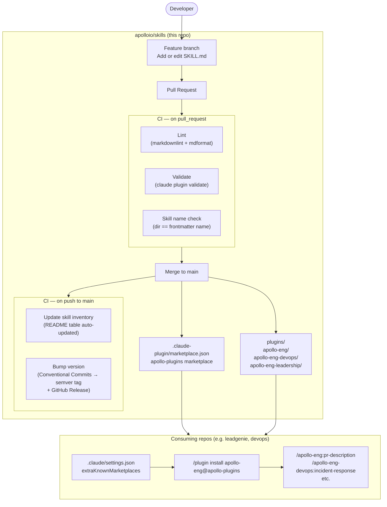

# Skills

<!-- VERSION-START -->

**Current version:** `v1.0.0`

<!-- VERSION-END -->

Apollo's shared [plugin marketplace](https://code.claude.com/docs/en/plugin-marketplaces#private-repositories) for Claude Code and Cowork. Install plugins to get reusable skills across any Apollo repo.

**Questions?** Ask in [#xfn-team-devops](https://apollo-io.slack.com/archives/xfn-team-devops).

## Installing Plugins

### Claude Code

1. **Add the marketplace** (one-time):

   ```text
   /plugin marketplace add git@github.com:apolloio/skills
   ```

1. **Install a plugin**

   - From the UI: **Browse and install plugins** → **apollo-plugins** → pick a plugin → Install now
   - Or run: `/plugin install apollo-eng@apollo-plugins`

1. **Use a skill**
   Mention it in chat (e.g. "Use the pr-description skill to generate a PR description") or run the command directly: `/apollo-eng:pr-description`

### Cowork

1. Run:

   ```text
   /plugin marketplace add git@github.com:apolloio/skills
   ```

1. Run `/plugin`

1. Tab over to **Marketplaces** → **apollo-plugins**

1. Select **Enable auto-update** while you are here

1. Select **Browse plugins**

1. Select a plugin to enable it

> [!NOTE]
> If you would like your Cowork plugin to be shown to users across the org, reach out to **Patrick Sullivan** to configure plugin visibility in the Claude Enterprise admin.

## Skill Inventory

<!-- SKILL-INVENTORY-START -->

| Plugin | Command | Description |
| --- | --- | --- |
| apollo-analytics | `/apollo-analytics:account-deep-dive` | Generate a comprehensive profile for a specific team/account combining revenue, credits, support, email, and events |
| apollo-analytics | `/apollo-analytics:battle` | "Run a Pokemon-style battle between Apollo employees using Trainer Cards derived from real work activity. Activate when user says battle, pokemon, trainer card, fight, matchup, who would win, or /battle." |
| apollo-analytics | `/apollo-analytics:credit-analysis` | Analyze credit utilization, consumption patterns, and monetization metrics |
| apollo-analytics | `/apollo-analytics:data-catalog-search` | Search the governed data catalog to find the right tables and understand business terms |
| apollo-analytics | `/apollo-analytics:metric-lookup` | Look up and execute pre-approved metric definitions from the Jarvis metric registry |
| apollo-analytics | `/apollo-analytics:product-debrief` | Generate product area performance summaries covering adoption, retention, and key metrics |
| apollo-analytics | `/apollo-analytics:weekly-insights` | Surface weekly strategic insights and recommendations for leadership |
| apollo-eng | `/apollo-eng:bug-bash-generator` | Generate bug bash test cases from a Notion bug bash page and write them to a Notion test case database. Activate when user asks to generate bug bash test cases, create bug bash tests, or mentions bug bash generation. |
| apollo-eng | `/apollo-eng:learn-from-chat` | Review the current conversation to identify user corrections, preferences, and patterns, then save them to Claude Code memory. Activate when the user says "learn from this chat", "learn from chat", "what did you learn", or "update your memory from this conversation". |
| apollo-eng | `/apollo-eng:plan-from-jira` | Fetches a Jira ticket using the Jira MCP, analyzes the requirements, and generates a structured implementation plan. Activate when the user provides a Jira issue key and asks to plan or implement it, says "plan from jira", "plan this ticket", or "create a plan for <TICKET-ID>". |
| apollo-eng | `/apollo-eng:pr-description` | Generate a clear PR title and description from the current branch's changes. Use when the user asks to fill the PR template, generate a PR description, prepare a PR, create a pull request, or before running gh pr create. |
| apollo-eng | `/apollo-eng:product-ship-post` | Generate product ship room posts for Slack announcements. Activate when user asks to write a ship post, product ship room post, release notes, or feature launch announcement. |
| apollo-eng | `/apollo-eng:security-review` | Perform security audit of Ruby controllers for IDOR vulnerabilities. Activate when user asks for security review, IDOR check, or authorization audit. |
| apollo-eng | `/apollo-eng:token-efficiency-assessment` | Run an interactive token efficiency self-assessment for Claude Code users. Activate when the user wants to check their token habits, assess token efficiency, prepare for a budget increase request, or says 'token efficiency assessment', 'token quiz', or 'check my token usage habits'. |
| apollo-eng-devops | `/apollo-eng-devops:cursor-rules` | Export Apollo skills as Cursor rules (.mdc files) into a project's .cursor/rules/ directory. Activate when the user wants to use Apollo skills in Cursor, asks to set up Cursor rules, export skills to Cursor, or mentions cursor-rules or .mdc. |
| apollo-eng-devops | `/apollo-eng-devops:devops` | Apollo SRE orchestrator — apply reliability engineering to any production task. Activate when discussing incidents, reliability design reviews, production debugging, architecture proposals, alert tuning, performance regressions, or toil reduction. |
| apollo-eng-devops | `/apollo-eng-devops:grafana-observability` | Grafana dashboard design and alert quality specialist. Activate when reviewing or creating Grafana dashboards, tuning alerts, reducing alert fatigue, designing SLO-based alerting, or conducting observability reviews. |
| apollo-eng-devops | `/apollo-eng-devops:incident-response` | Incident commander guide for Apollo production incidents. Activate when declaring or managing an incident, writing stakeholder communications, conducting a postmortem, or defining incident severity. |
| apollo-eng-devops | `/apollo-eng-devops:kubernetes-specialist` | Kubernetes debugging and rollout specialist for Apollo's GKE clusters. Activate when debugging pod crashes, CrashLoopBackOff, OOMKilled, readiness or liveness failures, deployment rollouts, HPA scaling, or resource limit tuning. |
| apollo-eng-devops | `/apollo-eng-devops:systematic-debugging` | Apply a four-phase root-cause debugging methodology to any production issue. Activate when the user is debugging a production problem, performance regression, or unexpected system behavior. |
| apollo-eng-leadership | `/apollo-eng-leadership:eng-metrics` | Summarize engineering metrics for a team or org. Activate when a manager asks for eng metrics, engineering health, developer productivity metrics, DORA metrics, or says "eng metrics". |
| apollo-eng-leadership | `/apollo-eng-leadership:learn-about-skills` | Explain how Cowork skills and plugins work in Apollo's shared skills marketplace. Use when the user asks how Cowork skills work, wants to browse or understand shared plugins, or wants help writing a new skill and opening a PR to add it to apolloio/skills. |
| apollo-eng-leadership | `/apollo-eng-leadership:okr-report` | Generate an OKR status report for an engineering team. Activate when a manager asks for an OKR report, OKR status, quarterly progress, key results update, or says "okr report". |
| apollo-eng-leadership | `/apollo-eng-leadership:sprint-planning` | Help prepare for sprint planning by summarizing carry-over work, team capacity, and suggested priorities. Activate when a manager asks to prepare for sprint planning, plan the next sprint, sprint prep, or says "sprint planning". |

<!-- SKILL-INVENTORY-END -->

## Where Do Skills Go at Apollo?

There are three places you can store Claude skills depending on your use case:

1. **In this central skill repository** — Shared skills available across all Apollo repos via the marketplace.

1. **In repo-specific skill folders** — Skills only relevant to a specific repository go in that repo's `.claude/skills` directory. Examples:

   - [`apolloio/devops/.claude/skills`](https://github.com/apolloio/devops/tree/master/.claude/skills)
   - [`apolloio/leadgenie/.claude/skills`](https://github.com/apolloio/leadgenie/tree/master/.claude/skills)

1. **In `~/.claude/skills`** — Personal skills for your local environment, not shared with others.

## Making Skills

Both Claude Code and Cowork skills use the same format: a `SKILL.md` file with YAML frontmatter (`name` and `description`) and a markdown body containing instructions.

### Adding a skill to an existing plugin

1. **Copy the template**

   ```text
   cp -r template/skills/example plugins/<plugin-name>/skills/<skill-name>
   ```

1. **Set frontmatter** in `SKILL.md`:

   - **name**: Lowercase, hyphenated (e.g. `my-skill`). Must match the directory name exactly (enforced by CI).
   - **description**: One line describing *what* the skill does and *when* Claude should use it. Include trigger phrases so the agent can discover it.

1. **Write the body** — Replace the placeholder with your instructions. You can add optional reference files (e.g. `references/playbook.md`) in the same skill directory.

1. **Validate** — Run `claude plugin validate .` from the repo root before committing.

### Claude Code skills

Claude Code skills typically automate developer workflows: generating PR descriptions, running security reviews, producing release notes. They have access to the terminal, file system, and git — so they can read code, run commands, and make changes.

### Cowork skills

Cowork skills help with workflows that don't require a local codebase: writing documentation, triaging bugs from Notion, generating reports, onboarding. They run in the Cowork web UI and can connect to tools via MCP servers.

When making a Cowork skill:

1. Put broadly useful Apollo workflows in a shared plugin in this repo.
1. Put repo-specific workflows in that repo's local `.claude/skills` directory instead.
1. Keep the `description` field explicit about both what the skill does and when it should activate.

The `apollo-eng-leadership` plugin includes `/apollo-eng-leadership:learn-about-skills` as an example people can run to understand how shared Cowork skills work before writing their own.

## Skills vs Agents

Plugins can contain both **skills** (`skills/<name>/SKILL.md`) and **agents** (`agents/<name>.md`):

- **Skill** — A step-by-step workflow Claude follows when invoked or auto-triggered. Write a skill when the task has defined steps and predictable output (e.g. `pr-description`, `incident-response`).
- **Agent** — A persona with domain expertise that reasons across varied questions. Write an agent when the task is open-ended and advisory (e.g. `jarvis.md` for analytics, `data-engineer.md` for warehouse guidance).

Many plugins use both: the agent defines expertise and guardrails, the skills define specific workflows that leverage that expertise.

> **Note:** Plugins can also include [MCP server configs](https://modelcontextprotocol.io/), context files, scripts, and other assets. See the [plugin spec](https://agentskills.io/specification) for the full directory layout.

## Naming Conventions

### Plugins

Plugins follow the pattern: `apollo-<dept>-<team>` or `apollo-<dept>` for department-wide plugins.

| Pattern | Example | When to use |
| --- | --- | --- |
| `apollo-<dept>` | `apollo-eng` | Skills useful across an entire department |
| `apollo-<dept>-<team>` | `apollo-eng-devops` | Skills specific to one team within a department |

Current plugins:

- **`apollo-eng`** — Shared engineering skills (PR descriptions, security reviews, ship posts)
- **`apollo-eng-devops`** — DevOps, SRE, and production reliability skills
- **`apollo-eng-leadership`** — Cowork skills for engineering managers (OKR reporting, eng metrics, planning)

If you want help creating an `apollo-<dept>-<team>` plugin for your team, reach out in [#claudathon](https://apollo-io.slack.com/archives/claudathon).

### Skills

Skill names are lowercase, hyphenated, and describe the action: `pr-description`, `incident-response`, `bug-bash-generator`.

Users invoke skills as `/plugin-name:skill-name` (e.g. `/apollo-eng:pr-description`).

## Adding a New Plugin

If you need a new plugin:

1. **Copy the template**

   ```text
   cp -r template plugins/<plugin-name>
   ```

1. **Edit the plugin manifest**
   In `plugins/<plugin-name>/.claude-plugin/plugin.json`, set `name`, `description`, and `version`.

1. **Register in the marketplace**
   In `.claude-plugin/marketplace.json`, add an entry to the `plugins` array:

   ```json
   {
     "name": "<plugin-name>",
     "source": "./plugins/<plugin-name>",
     "description": "Short description of the plugin"
   }
   ```

1. **Validate** — Run `claude plugin validate .` from the repo root.

1. **Add skills** — Follow "Adding a skill to an existing plugin" above.

## Suggesting This Marketplace From Other Repos

To have Claude Code suggest this marketplace when someone works in another repo (e.g. `leadgenie` or `devops`), add this to that repo's `.claude/settings.json`:

```json
{
  "extraKnownMarketplaces": {
    "apollo-plugins": {
      "source": {
        "source": "github",
        "repo": "apolloio/skills"
      }
    }
  }
}
```

To auto-enable specific plugins in that repo:

```json
{
  "enabledPlugins": {
    "apollo-eng@apollo-plugins": true
  }
}
```

### Auto-update

This marketplace uses `"autoUpdate": true` so every engineer gets the latest skills automatically without running `claude plugin update`. For a fast-moving internal repo this is the right tradeoff: skill authors ship improvements and everyone benefits immediately. The accepted risk is that any commit merged to `main` takes effect on consumer machines at next sync — so branch protection, required reviews, and CI validation on `main` are load-bearing controls.

See [Claude Code plugin marketplaces](https://code.claude.com/docs/en/plugin-marketplaces) for the full schema.

## Managing Plugin Visibility in Claude Enterprise

To control which plugins are visible to which users, have a Claude Enterprise owner configure visibility in the org admin settings. See [Anthropic's documentation](https://support.claude.com/en/articles/13837433-manage-cowork-plugins-for-your-organization#h_cef6a5f497) for details.

To request org-wide visibility for a Cowork plugin, reach out to **Patrick Sullivan**.

## Using Skills From Other AI Tools

Cursor and Windsurf can also load skills from `.claude/skills/` directories. Copy the `SKILL.md` file from this repo into your project's `.claude/skills/<skill-name>/` folder. See the [Cursor skills docs](https://cursor.com/help/customization/skills) and [Windsurf Cascade docs](https://docs.windsurf.com/windsurf/getting-started) for details.

## How This Repo Works



## Repository Structure

```text
.claude/
    settings.json
.claude-plugin/
    marketplace.json
.github/
    workflows/          # CI: lint, validate, bump-version, skill-pr-review, update-skill-inventory
    scripts/            # Helper scripts used by workflows
    skill-review-rubric.md
template/
    .claude-plugin/
        plugin.json
    skills/
        example/
            SKILL.md
plugins/
    apollo-eng/         # Shared engineering skills
        .claude-plugin/
            plugin.json
        skills/
            pr-description/
                SKILL.md
    apollo-eng-devops/  # DevOps and SRE skills
        ...
```

## Versioning and Releases

This repo uses [Conventional Commits](https://www.conventionalcommits.org/) to drive automatic semver tagging via `.github/workflows/bump-version.yml`. On every push to `main` the workflow:

1. Finds the latest `vMAJOR.MINOR.PATCH` tag.
1. Scans commit subjects and bodies since that tag.
1. Picks the highest-impact bump: **major** (`feat!:` or `BREAKING CHANGE`), **minor** (`feat:`), **patch** (`fix:` and other releasable types).
1. Skips tagging entirely for non-releasing types: `chore`, `docs`, `ci`, `style`, `test`.
1. Pushes an annotated tag and creates a GitHub Release with auto-generated notes.

**Branch convention:** Feature branches use the format `<user>/<ticket>-description` (e.g. `adzuci/ABC-123-add-bump-version-workflow`) and are merged to `main` via pull request.

## References

- [Agent Skills specification](https://agentskills.io/specification) — Format and conventions for skill files
- [Apollo Claude Skills Library](https://www.notion.so/apolloio/Claude-Skills-Library-2fbab2b3b4968002a11ad055663f0b05?source=copy_link) — Notion library of Apollo skills and ideas
