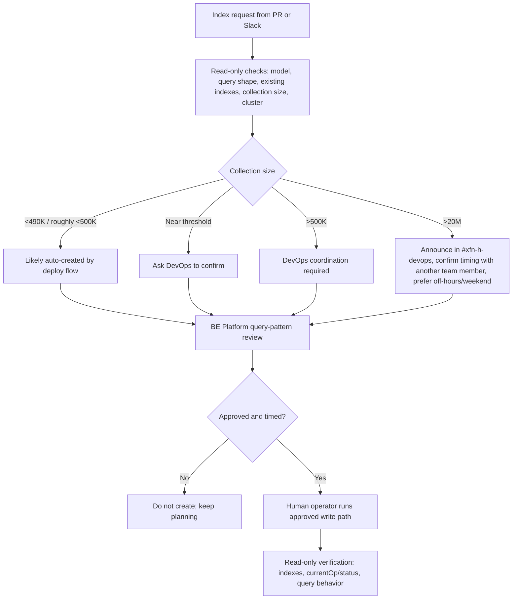

# Index Creation Workflow Reference

Authoritative runbooks (source of truth, re-check current wording):

- [Adding Indexes to the Mongo Collections](https://app.notion.com/p/apolloio/Adding-Indexes-to-the-Mongo-Collections-18fab2b3b4968091b280e6b461d26656?source=copy_link)
- [DevOps / Infrastructure Oncall Guidelines](https://app.notion.com/p/apolloio/DevOps-Infrastructure-Oncall-Guidelines-32fab2b3b49680699bf1c1191364dc30)

This skill is an operator companion for safe planning. It does read-only triage, drafts
handoffs, and gives human-run command templates. It does not execute index writes.

## Auto-create rules

Threshold wording has appeared as `<490K`, `<500K`, and roughly `500K` in internal docs
and Slack. Use the current Notion runbook as source of truth and be conservative near the
boundary.

## Required gates

- Verify existing index list before proposing a write.
- Verify collection size and actual cluster.
- Get BE Platform review for query pattern and index shape.
- For `>20M` documents, announce in `#xfn-h-devops`, confirm timing with another team
  member, prefer off-hours/weekend, and consider `mongo-upgrade`.
- Do not run write commands from the skill.
