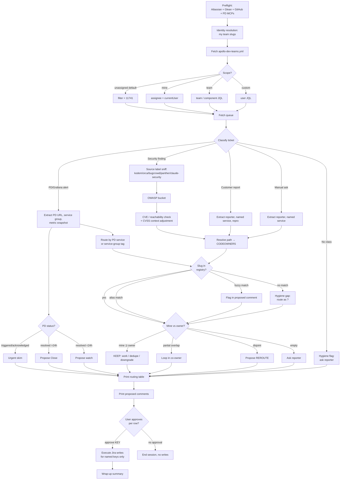

# Skill Architecture

End-to-end flow of `/apollo-eng-devops:incident-triage`. Use this as the map when debugging a step or proposing a change.

## Source-of-truth wiring

The skill never hardcodes team names, Slack channels, or routing tables. It reads:

| Source | What it provides | URL |
| ---------------------- | ---------------------------------------------------------------------- | ------------------------------------------------------------------------------ |
| `apollo-dev-teams.yml` | The canonical list of currently-active team slugs and their metadata. | <https://github.com/apolloio/leadgenie/blob/master/apollo-dev-teams.yml> |
| Repo `CODEOWNERS` | Path → team mapping for each repo. | `.github/CODEOWNERS` in each affected repo |
| PagerDuty (MCP) | Live PD incident status, service ownership, responder assignment. | `claude mcp add --transport sse -s user pagerduty https://mcp.pagerduty.com/sse` |

Team renames are handled gracefully — see the rename-fallback section in [`team-lookup.md`](team-lookup.md).

## When this skill is right vs wrong

**Use it when** you have a queue to work through and want a structured pass: classification, ownership resolution, dedup, and per-row approval gates. Works for weekly reviews, sprint planning, on-call handoff, or just "what's on my plate?"

**Don't use it when** you're working a single specific ticket — use the `plan-from-jira` skill instead.

**Don't use it for** real-time incident response (page-out, active customer impact). This skill is for triage of accumulated tickets, not the on-call playbook.
