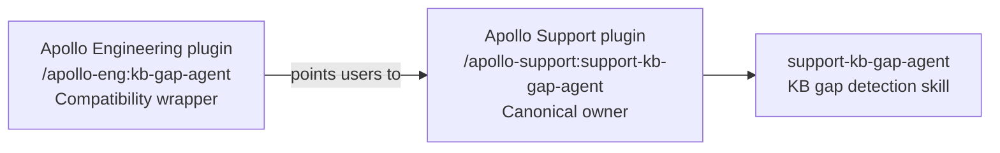

# Plugin Relationship — support-kb-gap-agent

Human migration map for `/apollo-support:support-kb-gap-agent`.

```mermaid
flowchart LR
    support["Apollo Support plugin<br/>/apollo-support:support-kb-gap-agent<br/>Canonical owner"]
    supportSkill["support-kb-gap-agent<br/>KB gap detection skill"]
    eng["Apollo Engineering plugin<br/>/apollo-eng:kb-gap-agent<br/>Compatibility wrapper"]

    support --> supportSkill
    eng -->|points users to| support
```
